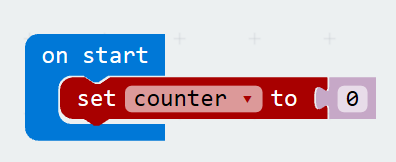
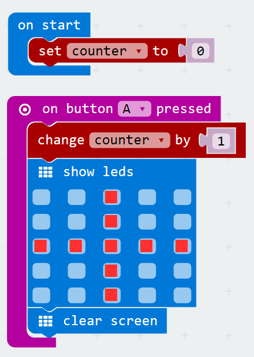
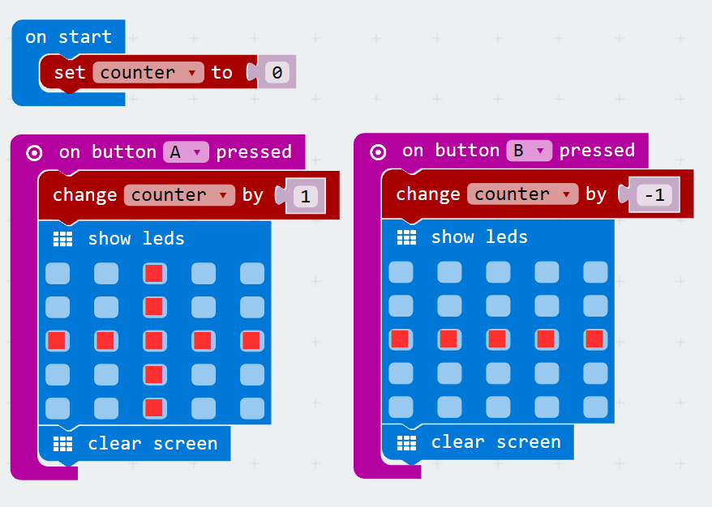
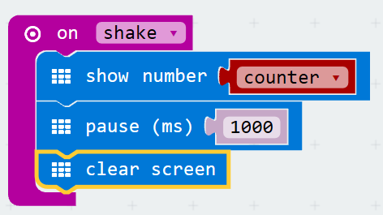

# Counter
[Home](./)

## Pseudocode

* Declare and Initialize a variable `counter` to zero.
* When the A button is pressed incrament our varable by one and display a + sign and clear the screen.
* When the B button is pressed decrement our varable by one and display a - sign and clear the screen.
* When the micro:bit is shaken display the current value for 1 second and then clear the screen.

## Our Program

1. Create a new program
1. In the variable section of our toolbox, click the 'Make a Variable' button. and call it 'counter'
1. Drag and drop the `set` block into the `on start` event, change the drop down to 'counter'. It should look something like this:

    

1. Drag and drop the `on button A pressed` event into our program.
1. Add a `change` variable block into our event, associate it to the 'counter' variable we created and the 'by' value to 1
1. Now display a '+' sign, using the 'show leds' basic block.
1. And finally a clear screen basic block.

    

1. Great, we are half way there, now we need to write the B button event. We could start from scratch, but lets 'duplicate' the A button event, and change a few things. To duplicate it, right click on the A button event and select duplicate.
1. Now you should have two, but one of them will be grayed out. Using the one that is currently grayed out, change the event to map to the B button, with the dropdown on the event.
1. Additionally, change the plus sign in the show leds block to be a minus sign. 
1. Next change the `change` brick from a by value of '1' to '-1'. When you are done you should have code that looks like this. Test it out in the simulator. 

    

1. Ok, now for our last requirement lets display the current value in counter when the micro:bit is shaken. Lets start by adding the `on shake` event.
1. To that event lets display the value in counter using a `show number` basic block and the counter `variable` block. 
1. We now need to wait for one second and then clear the screen. To wait we use the `pause` basic block. It time is set in milliseconds, so for 1 second we need to set it to 1000. 
1. Now we can add the clear screen command. Our `shake` event should look something like this:

    

1. Try our app out on the simulator, if everything looks good, lets name our app, save and download it to our micro:bit.
