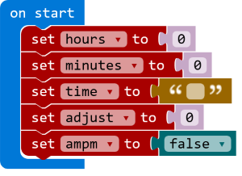
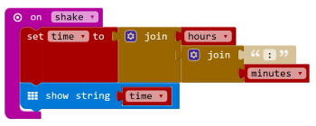
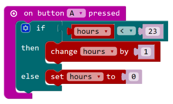
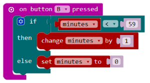
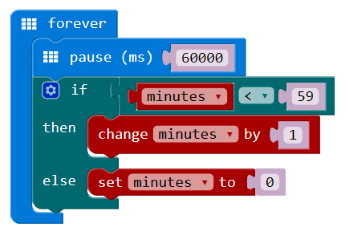
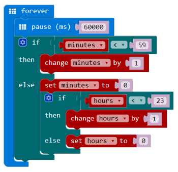
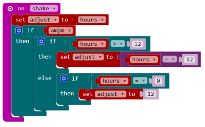
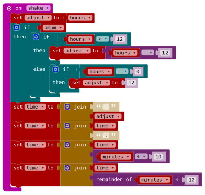
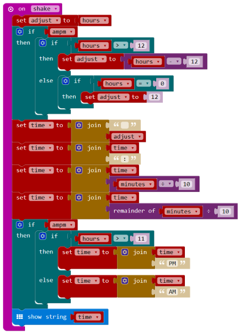

# Digital watch
[Home](./)

## Make the time variables
We need to make some variables to keep track of the time and for a few other things.
1. Go into **Basic** in the toolbox and pull an **basic:on start** on to the workspace.
2. Ok, in **Variables** click on `Make a Variable`. Name the variable as `hours`. Drag out a **variables:set to** block and change the name with the dropdown to `hours`. Place the variable into the **basic:on start** block.
3. Repeat this 4 more times to make variables named `minutes`, `time`, `adjust`, and `ampm`.
4. Now, for the **variables:set to** block for `time`, go to **Text** and drag a `" "` in and replace the `0`.
5. For the `ampm` variable, change the `0` there to a `false` from the **Logic** catagory. 

## Display the time, kind of

So, let's try showing the time on the display. We aren't keeping time yet but we'll just see if we can make our watch show something.

1. Get in the **Input** catagory and pull out an **input:on shake**. We'll have our watch show the time when it's shaken.
2. Get another **variables:set to** and put it into the **input:on shake**. Change the name to `time`.
3. Replace the `0` with a **text:join** from **Text**. Get another **text:join** and put it into the second slot of the first **text:join** you pulled out.
4. Change the `" "` in the first **text:join** to the `hours` variable. Change the text in the first slot of the second **text:join** to `":"`. And, change the last slot in the second **text:join** to the `minutes` variable.
5. Finally, stick in a **basic:show string** below the **variables:set to**. Switch the text inside to the variable `time`.
6. Download the code to you @boardname@ and give it a shake. Did you see the time of "0:0" go by on the LEDs?

## Set the time with buttons
There has to be a way to set the time on your watch. We'll use the buttons to set the current time. One button is for setting the hours and another button is for the minutes.

### Set the hours
Let's make a way to set the hours for the watch.

1. In **Input**, find an **input:on button pressed** an put it somewhere on the workspace.
2. Get an **logic:if then else** block from **Logic** and put it in the **input:on button pressed**.
3. From the same **Logic** category, get a **logic:0 < 0** and relpace the `false` condition with it.
4. Change the left `0` in the condtion to the `hours` variable. Change `0` on the right to `23`. This limits our hour count to 23 hours.
5. In the **logic:then** section, put a **variables:change by** there. Select the `hours` variable name from the dropdown.
6. In the **logic:else** section, put a **variables:set to** there. Select the `hours` variable name from the dropdown and leave the `0`.

### Set the minutes

Setting minutes is almost the same as setting hours but with just a few changes.
1. To make things easy, right click on **input:on button pressed** block and select the **Duplicate** option in the menu. This makes a copy of the original block.
2. In the new **input:on button pressed**, change the button to `B`.
3. Change every variable name from `hours` to  `minutes`. Change the `23` in the **logic:if** condition to ``59``. This is the limit of minutes we count.

### Select 24 hour or 12 hour time

Time is shown in either 24 hour or 12 hour format. We'll use one more button to choose which format to show. Using the 12 hour format adds an 'AM' or 'PM' at the end.

1. In **Input**, get an **input:on button pressed** an put it on the workspace. Change the button to `A+B`.
2. Grab a **variables:set to**, put it in the block and change the variable to `ampm`. Put a **logic:not** from **Logic** in where the `0` is.
3. Pick up a `ampm` from **Variables** and connect it on the right of the **logic:not**. This switches our 24 hour format to 12 hour and back.

## Make the timer tick

A watch really has three parts: the display, settings, and timer. We need a way to make the minutes and hours count up at the right time. Let's code the timer.

1. In **Basic**, get a **basic:forever** loop out to the workspace.
2. Also in **Basic**, take out a **basic:pause** an put it into the loop. Change the time from `100` to `60000`. The time is in milliseconds so we want to count each minute every 60000 milliseconds.
3. Below the **basic:pause**, put a **logic:if then else** block. Change the condition in the **logic:if** to use a **logic:0 < 0**.
4. Replace the `0` on the left with the `minutes` variable. Change the `0` on the right to `59`.
5. Put a **variables:change by** into the **logic:then**. Change the variable to `minutes`.
6. Get a **variables:set to** and put it in the **logic:else**. Again, change the variable to `minutes`.

**Keep on coding...**

1. Now, take another **logic:if then else** and put it just below the **variables:set to** inside the first **logic:else**.
2. In the second **logic:if**, put in a **logic:0 < 0** as the condition. Replace the left `0` with the `hours` variable. Change the right `0` to `23`. We count hours up to 23 until we go back to 0 (midnight).
3. Put a **variables:change by** into the second **logic:then**. Change the variable to `hours`.
4. Get a **variables:set to** and put it in the second **logic:else**. Again, change the variable to `hours`. Ok, the timer's ready to tick.

## Shake and show...the time!

We're going back to the display code we made earlier. We'll now make it show the real time! This step is going to be busy but we'll get it done.

First, we have to code an adjustment for the hours number when we're using the 12 hour format.

1. Find the **input:on shake** block we coded earlier. Pull out and drag to the trash the blocks inside. We're starting fresh.
2. Pull out a **variables:set to** an put it inside the **input:on shake**. Change the variable to `adjust`. Change the `0` on the right to the `hours` variable.
3. Get a **logic:if then** and put it under the **variables:set to**. Replace the condition with the `ampm ` variable.
4. Grab a **logic:if then else** and put it in the **logic:then** part of the first **logic:if then**. Change the condition to **logic:0 < 0**. Replace the `0` on the left with the `hours` variable. Change the `0` on the right to `12`. Switch the `<` to a `>`.
5. Go get another **variables:set to** and put it in the **logic:then** of the second **logic:if then else**. Change the variable to `adjust`. In **Math** take a **math:0 - 0** and replace the `0` in the **variables:set to**. Change the `0` on the left to the `hours` variable and the `0` on the right to `12`.
6. Take one more **logic:if then** and put it in the **logic:else**. Change its condition to **logic:0 = 0**. Put the `hours` variable in place of the `0` on the left.
7. Inside this last **logic:if then** place a **variables:set to**. Change the variable name to `adjust` and set the value to `12`.

**Keep on coding...**

Now, we have to join up the hours and minutes to make text that will display on the watch.

1. At the bottom of the **input:on shake**, insert a **variables:set to**. Change the variable name to `time`. Connect it to a **text:join** from **Text**.
2. Make 3 copies of this last **variables:set to** using the **Duplicate** option in the menu when you right click on the block. Put the copies underneath each other so that all 4 are stacked together.
3. In the first **variables:set to**, replace the second `""` in the **text:join** with the `adjust` variable.
4. With the second copy, change the first `""` in the **text:join** to the variable `time`. Change the second string in the **text:join** to `":"`.
5. In the third copy, change the first `""` in the **text:join** to the variable `time`. Change the second string in the **text:join** to division operator from **Math**. Set the left `0` to the `minutes` variable and the right `0` to `10`.
6. In the fourth copy, change the first `""` in the **text:join** to the variable `time`. Change the second string in the **text:join** to a **Math:remainder of** in **Math**. Set the left `0` to the `minutes` variable and the right `0` to `10`.

**Keep on coding...**

Ok, we're getting close to finishing now. Here we need to add the 'AM' or 'PM' if we are in 12 hour format. Then, finally, display the complete time string.

1. Put an **logic:if then** block at the end of the **input:on shake**. Replace the `true` condition with the variable `ampm`.
2. Insert a **logic:if then else** into this **logic:if then**. Use a **logic:0 < 0** as the condition. Change the left `0` to the `hours` variable. Change the right `0` to `11`. Switch the `<` to a `>`.
3. Place a **variables:set to** in the **logic:then**. Change the variable to `time` and attach a **text:join**. Make the first part of the **text:join** be the variable `time` and the second part to the text `"PM"`.
4. Do the exact same thing as in the last step but put the **variables:set to** block in the **logic:else** underneath. Make the second part of the **text:join** be `"AM"` this time.
5. Finally, at the very bottom of **input:on shake**, go get a **basic:show string** from **Basic** and put it there. Change the string `"Hello!"` to the `time` variable.

## Code Complete

Wow, so awesome! You've got your watch coded and ready to try. Go press the **Download** button and put your code on your micro:bit. When you shake it, it shows the current time.

Right now, it's showing 24 hour format: hours go from `0` to `23` and back to `0`. Press the **A+B** buttons together to change to 12 hour format: hours go from `12` to `12` with `1` through `11` in between. It has either `"AM"` or `"PM"` at the end.

To set it to the current time, you use the **A** and **B** buttons. The **A** button moves the current hour up by one each time it's pressed. The **B** button moves the minutes up by one every time it's pressed.

## Enhancements

Think about how you can enchance your watch application. Can you chang the code to make it simpler? Are there any features you would like to add? 
